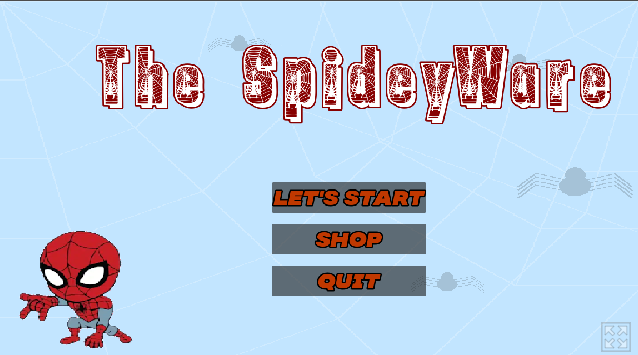
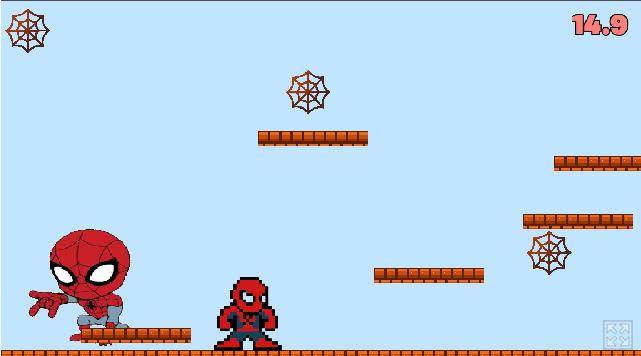

# TheSpideyWare

A pixel-art platformer where you jump and explore Spidey-themed levels — made with Godot.

## Try it

▶️ **[Play TheSpideyWare in your browser](https://trion17fft.itch.io/thespideyware)** — no install needed.

## Quick start

1. Open the [itch.io page](https://trion17fft.itch.io/thespideyware).
2. Click play — the game runs directly in the browser (HTML5).
3. Swing, jump, and explore.

## Controls

| Action       | Key(s)              |
| ------------ | --------------------|
| Move         | Arrow keys / WASD   |
| Jump         | Space               |
| Clicker , Shop     | D  /  F   ,      Space      |

## Features

- 2D pixel-art platforming with web-swinging and climbing mechanics
- Multiple levels to explore
- Original Spidey-inspired art, fonts, and title screen
- Playable directly in the browser, no download required

## Credits

- Built with [Godot Engine](https://godotengine.org/)
- Fonts: MADE Soulmaze (personal use), Spiderman font
- Made by [Trion17fft](https://github.com/Trion17fft)